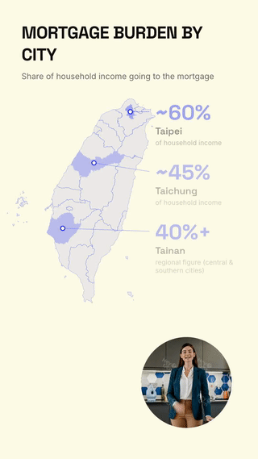
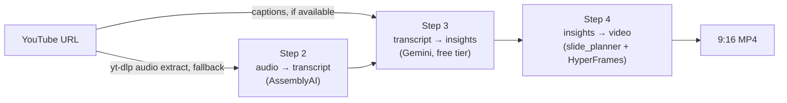

# Video Condenser

Turns a long-form video into a short, narrated, vertical (9:16) insight video —
end to end, no manual editing step in between.

```
YouTube URL → transcript → journalistic insights → narrated video
```

Built as an engineering artifact, not a content-production shortcut: every stage
is a standalone script you can run and inspect on its own, every paid/metered
call is explicit and gated behind a manual step, and every number that ends up
on screen is traceable back to either the source transcript or an explicit
"not verified" flag — never a model guess dressed up as a fact.

## Demo



*A ~12s clip of the current run's regional map slide — location callouts
light up in sequence as a HeyGen avatar (audio-driven off this pipeline's
own Kokoro narration, not HeyGen's own TTS) speaks each city's figure in
turn. Full videos below are playable directly on GitHub (click through to
`video/*.mp4` in each run's folder).*

If you're new to this repo, the three runs below are the same video rebuilt
three times as features were added — not three different inputs. What
changed, in plain terms:

| Run | What you'd notice watching it | Slides | Length | Video |
|---|---|---|---|---|
| [`run_3`](runs/run_3_kokoro_gemini_render/) | The baseline: a narrated slide deck, one fact/number set per slide | 9 | 4:03 | [`video/KjAI9r8tnOs.mp4`](runs/run_3_kokoro_gemini_render/video/KjAI9r8tnOs.mp4) |
| [`run_4`](runs/run_4_height_n_animation/) | Same content, tighter slides (no empty space, no clipped text) and each bullet lights up as it's spoken | 7 | 4:03 | [`video/KjAI9r8tnOs.mp4`](runs/run_4_height_n_animation/video/KjAI9r8tnOs.mp4) |
| [`run_5`](runs/run_5_map_avatar_presenter/) | The multi-city stat moves off a bullet slide onto an actual map, with a talking avatar presenting it | 8 | 3:51 | [`video/KjAI9r8tnOs.mp4`](runs/run_5_map_avatar_presenter/video/KjAI9r8tnOs.mp4) |
| [`run_6`](runs/run_6_audio_driven_avatar/) (current) | Same map + avatar idea as run_5, but the avatar now speaks both city callouts (in this pipeline's own narration voice) instead of one generic line, so they light up one after another instead of all at once | 8 | 4:03 | [`video/KjAI9r8tnOs.mp4`](runs/run_6_audio_driven_avatar/video/KjAI9r8tnOs.mp4) |

The full technical diff for each run (exactly which function changed and
why) is in [`runs/README.md`](runs/README.md) — the table above is the
30-second version.

## Pipeline at a glance



| Step | What it does | Tool / API | Script |
|---|---|---|---|
| 1 | Get a transcript from a YouTube URL (captions first, ASR fallback) | `youtube-transcript-api`, `yt-dlp` | [`youtube_transcript.py`](youtube_transcript.py) |
| 2 | Audio → transcript text (only hit when Step 1 has no captions) | AssemblyAI (managed ASR) | [`transcribe_audio.py`](transcribe_audio.py) |
| 3 | Transcript → structured, non-plagiarized journalistic insights | Google Gemini (free tier) | [`extract_insights.py`](extract_insights.py) |
| 3.5 | Group facts / detect chartable numbers (reasoning layer, fails soft) | Google Gemini (same key) | [`slide_planner.py`](slide_planner.py) |
| 4 | Insights → narrated 9:16 video | Kokoro-82M (local TTS) + HyperFrames (HTML→MP4) | [`build_video.py`](build_video.py) |
| 4a (optional) | Regional map slide with location callouts | deterministic, no LLM | [`map_slide.py`](map_slide.py) |
| 4b (optional, metered) | Avatar presenter clip for the map slide | HeyGen (avatar + TTS) | [`tools/heygen_avatar/`](tools/heygen_avatar/) |

See [`docs/ARCHITECTURE.md`](docs/ARCHITECTURE.md) for what each stage actually
reads/writes and why, and [`docs/DECISIONS.md`](docs/DECISIONS.md) for why these
particular tools were picked over the alternatives.

## Scope: YouTube URL input only

This pipeline assumes a YouTube URL as input, end to end
(`youtube_transcript.py`) — a deliberate scope decision, not an oversight.
A couple of scripts' docstrings still reference a `video_to_audio.py` for a
local video *file* as input; that was an early idea, never built, and isn't
planned. If you need that path anyway, `ffmpeg -i input.mp4 -vn audio.wav`
gets you an audio file `transcribe_audio.py` can already consume directly.

## Quickstart

```bash
# 1. Install dependencies (requirements.txt is aggregated from each
#    stage's own docstring - see that file's header if a version ever
#    needs pinning):
pip install -r requirements.txt --break-system-packages

# 2. Copy the env template and fill in free-tier keys
cp .env.example .env
#   ASSEMBLYAI_API_KEY  - https://www.assemblyai.com/ (free signup)
#   GEMINI_API_KEY      - https://aistudio.google.com/apikey (free tier, no card)

# 3. Run the pipeline stage by stage, by video ID / identifier
python3 youtube_transcript.py "https://youtube.com/watch?v=<id>"
python3 extract_insights.py <id>
python3 build_video.py <id>

# 4. Render (from render/ - needs Node; see SETUP.md for the one-time
#    Kokoro model download and optional HeyGen avatar setup)
cd render && npm run check && npx hyperframes render . \
  -c compositions/<id>.html -o ../videos/<id>.mp4 -q draft
```

`SETUP.md` covers one-time local setup (the Kokoro TTS model download, the
Taiwan map asset, and the optional HeyGen avatar CLI). Nothing in the pipeline
calls a paid/metered API automatically — the HeyGen avatar step in particular
is a deliberate, manual, cost-aware script you run yourself (see its own
docstring in [`tools/heygen_avatar/generate_avatar_clip.py`](tools/heygen_avatar/generate_avatar_clip.py)).

## Repo layout

```
youtube_transcript.py    Step 1 - YouTube URL -> transcript (captions or ASR fallback)
transcribe_audio.py      Step 2 - audio -> transcript (AssemblyAI)
extract_insights.py      Step 3 - transcript -> journalistic insights (Gemini)
slide_planner.py         Step 3.5 - fact grouping / chart detection (Gemini, fails soft)
build_video.py           Step 4 - insights -> composition -> MP4 (Kokoro + HyperFrames)
map_slide.py             Optional regional-map slide (deterministic)
storage.py               Shared save/load convention (transcripts/, insights/, ...)
tools/heygen_avatar/      Manual, metered avatar-clip generator + its recovery script
tools/taiwan_map/         One-time generator for render/vendor/taiwan_map.json
render/                   HyperFrames project (compositions, vendored fonts/GSAP)
runs/                     Frozen before/after snapshots of past renders (see runs/README.md)
docs/                     ARCHITECTURE.md, DECISIONS.md
```

Generated, per-video artifacts (`transcripts/`, `insights/`, `slides/`,
`render/compositions/*.html`, `videos/*.mp4`, `avatar_clips/`) are gitignored —
anyone cloning the repo regenerates them by running the pipeline on their own
video, rather than pulling down someone else's rendered output.

## Cost & quota awareness

Every external call in this pipeline is either free-tier-with-no-card or
metered-and-explicitly-gated:

| Service | Tier | Gated how |
|---|---|---|
| AssemblyAI ASR | Free signup allowance | Called automatically, but only when YouTube captions are unavailable |
| Google Gemini (insights + slide planning) | Free tier, no billing | Called automatically; both call sites fail soft to a deterministic fallback |
| Kokoro-82M TTS | Local, unlimited | One-time ~340 MB model download, then fully offline |
| HeyGen avatar video | **Metered, real-money-adjacent** | Never called automatically — one manual script, one generation per run, `--dry-run` available to preview cost-free |
| HeyGen TTS (duration measurement only) | Free-tier allowance | Small per-line calls, not the metered avatar endpoint |

See [`docs/DECISIONS.md`](docs/DECISIONS.md) for the reasoning behind keeping
this split this explicit.

## Third-party tools & attribution

| Tool / data | License | Used for |
|---|---|---|
| [youtube-transcript-api](https://github.com/jdepoix/youtube-transcript-api) | MIT | Pulling existing YouTube captions |
| [yt-dlp](https://github.com/yt-dlp/yt-dlp) | Unlicense | Audio-only extraction when no captions exist |
| [AssemblyAI](https://www.assemblyai.com/) | Commercial API, free tier | Speech-to-text fallback |
| [Google Gemini API](https://ai.google.dev/) | Commercial API, free tier | Insight extraction, slide/chart planning |
| [Kokoro-82M](https://github.com/thewh1teagle/kokoro-onnx) via `hyperframes tts` | Apache-2.0 (model) | Local, offline narration |
| [HyperFrames](https://github.com/heygen-com/hyperframes) | See its own repo | HTML composition → MP4 rendering |
| [HeyGen](https://www.heygen.com/) | Commercial API, metered | Optional avatar presenter clip |
| [taiwan-atlas](https://www.npmjs.com/package/taiwan-atlas) | MIT | County boundaries for the regional map slide |
| [topojson-client](https://www.npmjs.com/package/topojson-client) / [topojson-simplify](https://www.npmjs.com/package/topojson-simplify) | ISC | TopoJSON processing for the map asset |
| [d3-geo](https://www.npmjs.com/package/d3-geo) | ISC | Map projection |

## License

MIT (see [`LICENSE`](LICENSE)) — chosen for consistency with the permissive
third-party pieces above (`taiwan-atlas` MIT, `topojson-*`/`d3-geo` ISC), and
because there's no reason to restrict reuse of this repo's own code.

## Status

The current published result is `run_6_audio_driven_avatar/` — the avatar
presenter redesigned to lip-sync against this pipeline's own narration audio
instead of HeyGen's own TTS, with an idempotency guard and fail-fast error
diagnosis around the one metered call in the pipeline (see
[`docs/DECISIONS.md`](docs/DECISIONS.md)). `run_5_map_avatar_presenter/` is
kept as the prior avatar version (script-driven) and
`run_3_kokoro_gemini_render/` remains the frozen baseline for before/after
comparison; see [`runs/README.md`](runs/README.md) for the full history and
what changed in each run. Everything under `runs/` is a snapshot copied out
by hand after a render — re-running the pipeline never reads from or writes
to that folder.
